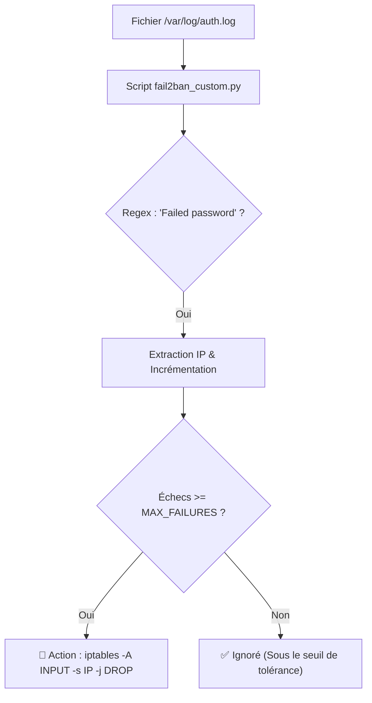

#  Custom SSH Fail2Ban (Log Analyzer)

Un outil de sécurité brut et autonome (Zero-Dependency) conçu pour protéger les serveurs Linux contre les attaques par force brute sur le service SSH. 

Contrairement à des solutions lourdes, ce script va droit au but : il parse les journaux d'authentification (`auth.log`), extrait les adresses IP malveillantes via expressions régulières (Regex), et interagit directement avec le pare-feu du noyau (`iptables`) pour bannir les attaquants qui dépassent le seuil de tolérance.

##  Flux de Détection et de Blocage


# Fonctionnalités
100% Bibliothèque Standard : Aucun pip install requis, réduisant drastiquement la surface d'attaque et facilitant le déploiement.

Mode Dry-Run : Intègre un mode de simulation par défaut pour tester la détection sans s'auto-bannir par erreur.

Action Directe : Utilise os.system pour interagir avec Netfilter/iptables de manière instantanée.

# Configuration & Test Local
Un fichier sample_auth.log peut être utilisé pour tester le script en toute sécurité sur votre machine avant le passage en production.

```bash
git clone https://github.com/FilouCosmos/ssh-log-analyzer.git
cd ssh-log-analyzer
# Exécutez le script en mode Dry-Run (Simulation) :
python3 fail2ban_custom.py
```
# Passage en Production
Pour protéger un vrai serveur, éditez fail2ban_custom.py :

Changez LOG_FILE pour /var/log/auth.log (Debian/Ubuntu) ou /var/log/secure (RHEL/CentOS).

Passez la variable DRY_RUN à False.

Lancez le script en tant que root (requis pour la commande iptables).

# Automatisation (Cron)
Pour que ce script remplace un daemon Fail2Ban, planifiez son exécution toutes les 5 minutes via la crontab de l'utilisateur root (sudo crontab -e) :
```bash
*/5 * * * * /usr/bin/python3 /chemin/vers/ssh-log-analyzer/fail2ban_custom.py >> /var/log/custom_ips.log 2>&1
```
